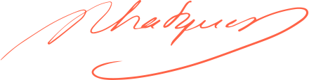

<h1 align="center">vnphanquang</h1>

<p align="center">
  <a href="https://github.com/vnphanquang" target="_blank">
    
  </a>
</p>

<p align="center">Ho Chi Minh, Vietnam</p>

<details>
  <summary>🤓 About me</summary>

  <details align="center">
    <summary>My story</summary>
    <details align="center">
      <summary>Expand to see more of this</summary>
      <details align="center">
        <summary>Make this open to see some miracles</summary>
        <details align="center">
          <summary>You are getting there, keep going!</summary>
          <details align="center">
            <summary>You do really want to see how this ends, don't you?</summary>
            <details align="center">
              <summary>Well I have some exciting news to tell you</summary>
              <details align="center">
                <summary>You just wasted 5 seconds for this crap</summary>
                <details align="center">
                  <summary>Get your butt back to work</summary>
                  <details align="center">
                    <summary>Shame on you I have no story</summary>
                    <details align="center">
                      <summary>Okay now you are getting me annoyed...</summary>
                      <details align="center">
                        <summary>Okay okay, I will tell you my story, geez louise!</summary>
                        <details align="center">
                          <summary>It goes like this:</summary>
                          <details align="center">
                            <summary>...</summary>
                          </details>
                        </details>
                      </details>
                    </details>
                  </details>
                </details>
              </details>
            </details>
          </details>
        </details>
      </details>
    </details>
  </details>

  <br />

  My name is Quang Phan. I am a learner and a developer. This is where I dedicate my energy to the open source community.

  You are probably bored already so get back to whatever you were doing. See you out there on the field.

  In case you want to reach me, find me at `vnphanquang` on most social platforms.

  Cheers!
</details>

<br />

<details>
  <summary>💾 Current Setup</summary>
  <br />

My keyboard: [ZSA Moonlander](https://www.zsa.io/moonlander) [![monkeytype.badge]][monkeytype]

See my [.config] here for all my setup.

I mostly use Linux: [i3wm] & [polybar], [alacritty], [fish], [tmux], [neovim],

[![setup screenshot][local.images.setup]][.config]

I also use mac at work sometimes but only when i am forced too 😂.

</details>

<br />

<details>
  <summary>📚 Resources that helped me build this profile</summary>
  <br />

- [`awesome` collection of Github profiles](https://github.com/abhisheknaiidu/awesome-github-profile-readme#icons-) for inspiration
- [simpleicons](https://simpleicons.org/) for svg icons
- [getavataaars](https://getavataaars.com/) for avatar generation
- [wakatime](https://wakatime.com/dashboard), [wakatime-vscode](https://marketplace.visualstudio.com/items?itemName=WakaTime.vscode-wakatime) and the [anmol098/waka-readme-stats](https://github.com/anmol098/waka-readme-stats) github action for the coding stats section at end of this profile.

glhf!
</details>

<br />

<details>
  <summary>📈 My Statistics</summary>
  <br />

<!--START_SECTION:waka-->


**I'm an Early 🐤** 

```text
🌞 Morning                8982 commits        ███████░░░░░░░░░░░░░░░░░░   27.49 % 
🌆 Daytime                13792 commits       ███████████░░░░░░░░░░░░░░   42.22 % 
🌃 Evening                9516 commits        ███████░░░░░░░░░░░░░░░░░░   29.13 % 
🌙 Night                  380 commits         ░░░░░░░░░░░░░░░░░░░░░░░░░   01.16 % 
```
📅 **I'm Most Productive on Wednesday** 

```text
Monday                   4865 commits        ████░░░░░░░░░░░░░░░░░░░░░   14.89 % 
Tuesday                  3648 commits        ███░░░░░░░░░░░░░░░░░░░░░░   11.17 % 
Wednesday                7107 commits        █████░░░░░░░░░░░░░░░░░░░░   21.75 % 
Thursday                 4573 commits        ████░░░░░░░░░░░░░░░░░░░░░   14.00 % 
Friday                   5216 commits        ████░░░░░░░░░░░░░░░░░░░░░   15.97 % 
Saturday                 4858 commits        ████░░░░░░░░░░░░░░░░░░░░░   14.87 % 
Sunday                   2403 commits        ██░░░░░░░░░░░░░░░░░░░░░░░   07.36 % 
```


📊 **This Week I Spent My Time On** 

```text
🕑︎ Time Zone: Asia/Ho_Chi_Minh

💬 Programming Languages: 
TypeScript               7 hrs 45 mins       ████████████████░░░░░░░░░   64.42 % 
Svelte                   2 hrs 28 mins       █████░░░░░░░░░░░░░░░░░░░░   20.59 % 
Rust                     1 hr 17 mins        ███░░░░░░░░░░░░░░░░░░░░░░   10.68 % 
Other                    15 mins             █░░░░░░░░░░░░░░░░░░░░░░░░   02.15 % 
SQL                      7 mins              ░░░░░░░░░░░░░░░░░░░░░░░░░   01.08 % 

🔥 Editors: 
Neovim                   12 hrs 2 mins       █████████████████████████   100.00 % 

💻 Operating System: 
Linux                    12 hrs 2 mins       █████████████████████████   100.00 % 
```

**I Mostly Code in TypeScript** 

```text
TypeScript               33 repos            ██████████░░░░░░░░░░░░░░░   38.82 % 
JavaScript               22 repos            ██████░░░░░░░░░░░░░░░░░░░   25.88 % 
Svelte                   13 repos            ████░░░░░░░░░░░░░░░░░░░░░   15.29 % 
CSS                      4 repos             █░░░░░░░░░░░░░░░░░░░░░░░░   04.71 % 
Jupyter Notebook         1 repo              ░░░░░░░░░░░░░░░░░░░░░░░░░   01.18 % 
```


 Last Updated on 24/02/2026 00:50:37 UTC
<!--END_SECTION:waka-->

</details>


<br />

<p align="center">
  <a href="https://github.com/vnphanquang" target="_blank">
    
  </a>
</p>

[monkeytype.badge]: https://img.shields.io/endpoint?style=for-the-badge&url=https%3A%2F%2Fmonkeytype-badge-vhd5lan7mmhz.runkit.sh%3Fmessage%3D110wpm%26label%3Dmonkeytype%26logoVariant%3Done
[monkeytype]: https://monkeytype.com/

[alacritty]: https://alacritty.org/
[polybar]: https://github.com/polybar/polybar
[i3wm]: https://i3wm.org/
[tmux]: https://github.com/tmux/tmux/wiki
[fish]: https://fishshell.com/
[neovim]: https://neovim.io/
[vscode]: https://code.visualstudio.com/
[vscode.vim]: https://marketplace.visualstudio.com/items?itemName=vscodevim.vim

[.config]: https://github.com/vnphanquang/.config
[local.images.setup]: ./.github/images/setup.png
