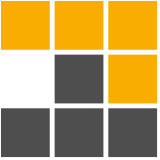

<h1 align="center">vnphanquang</h1>

<p align="center">
  <a href="https://github.com/vnphanquang" target="_blank">
    
  </a>
</p>

<p align="center">He/him/his</p>

<p align="center">Ho Chi Minh, Vietnam</p>

<br />

<!-- icon: https://simpleicons.org -->

<p align="center">
  <a href="https://twitter.com/vnphanquang" target="_blank">
    
  </a>
  &nbsp; &nbsp;
  <a href="https://linkedin.com/in/vnphanquang" target="_blank">
    
  </a>
  &nbsp; &nbsp;
  <a href="https://stackoverflow.com/users/9943094" target="_blank">
    
  </a>
  &nbsp; &nbsp;
  <a href="https://instagram.com/vnphanquang" target="_blank">
    
  </a>
  &nbsp; &nbsp;
  <a href="https://jsfiddle.net/user/vnphanquang" target="_blank">
    
  </a>
</p>

<br />

<p align="center">
  <a href="https://www.buymeacoffee.com/vnphanquang" target="_blank>
    
  </a>
</p>

<br />

<details>
  <summary>🤓 About me</summary>

  <details align="center">
    <summary>My story</summary>
    <details align="center">
      <summary>Expand to see more of this</summary>
      <details align="center">
        <summary>Make this open to see some miracles</summary>
        <details align="center">
          <summary>You are getting there, keep going!</summary>
          <details align="center">
            <summary>You do really want to see how this ends, don't you?</summary>
            <details align="center">
              <summary>Well I have some exciting news to tell you</summary>
              <details align="center">
                <summary>You just wasted 5 seconds for this crap</summary>
                <details align="center">
                  <summary>Get your butt back to work</summary>
                  <details align="center">
                    <summary>Shame on you I have no story</summary>
                    <details align="center">
                      <summary>Okay now you are getting me annoyed...</summary>
                      <details align="center">
                        <summary>Okay okay, I will tell you my story, geez louise!</summary>
                        <details align="center">
                          <summary>It goes like this:</summary>
                          <details align="center">
                            <summary>...</summary>
                          </details>
                        </details>
                      </details>
                    </details>
                  </details>
                </details>
              </details>
            </details>
          </details>
        </details>
      </details>
    </details>
  </details>

  <br />

  My name is Quang Phan. I am a learner and a developer. This is where I dedicate my energy to the open source community.

  You are probably bored already so get back to whatever you were doing. See you out there on the field.

  In case you want to reach me, find me at `vnphanquang` on most social platforms.

  Cheers!
</details>

<br />

<details>
  <summary>👍 Current Favorite Technologies</summary>
  <br />
  <p align="left">
    <a href="https://svelte.dev" target="_blank" rel="noreferrer">
      
    </a>
    <a href="https://tailwindcss.com/" target="_blank" rel="noreferrer">
      
    </a>
    <a href="https://www.typescriptlang.org/" target="_blank" rel="noreferrer">
      
    </a>
    <a href="https://www.postgresql.org" target="_blank" rel="noreferrer">
      
    </a>
    <a href="https://graphql.org" target="_blank" rel="noreferrer">
      
    </a>
    <a href="https://www.rust-lang.org" target="_blank" rel="noreferrer">
      
    </a>
    <a href="https://xstate.js.org/" target="_blank" rel="noreferrer">
      
    </a>
    <a href="https://pnpm.io/" target="_blank" rel="noreferrer">
      
    </a>
  </p>
</details>

<br />

<details>
  <summary>🛠️ Other Languages and Tools</summary>
  <br />
  <details open>
    <summary>Languages</summary>
    <br />
    <p algin="left">
      <a href="https://www.typescriptlang.org/" target="_blank" rel="noreferrer">
        
      </a>
      <a href="https://www.w3.org/html/" target="_blank" rel="noreferrer">
        
      </a>
      <a href="https://www.w3schools.com/css/" target="_blank" rel="noreferrer">
        
      </a>
      <a
        href="https://www.gnu.org/software/bash/"
        target="_blank"
        rel="noreferrer"
      >
        
      </a>
      <a href="https://www.rust-lang.org" target="_blank" rel="noreferrer">
        
      </a>
      <a href="https://www.python.org" target="_blank" rel="noreferrer">
        
      </a>
    </p>
  </details>

  <details open>
    <summary>Frameworks</summary>
    <br />
    <p align="left">
      <a href="https://svelte.dev" target="_blank" rel="noreferrer">
        
      </a>
      <a href="https://tailwindcss.com/" target="_blank" rel="noreferrer">
        
      </a>
      <a href="https://xstate.js.org/" target="_blank" rel="noreferrer">
        
      </a>
      <a href="https://rxjs.dev" target="_blank" rel="noreferrer">
        
      </a>
      <a href="https://angular.io" target="_blank" rel="noreferrer">
        
      </a>
      <a href="https://reactjs.org/" target="_blank" rel="noreferrer">
        
      </a>
      <a href="https://www.electronjs.org" target="_blank" rel="noreferrer">
        
      </a>
      <a href="https://nestjs.com/" target="_blank" rel="noreferrer">
        
      </a>
      <a href="https://www.graphile.org/postgraphile/" target="_blank" rel="noreferrer">
        
      </a>
      <a href="https://expressjs.com/" target="_blank" rel="noreferrer">
        
      </a>
    </p>
  </details>

  <details open>
    <summary>Databases</summary>
    <br />
    <p align="left">
      <a href="https://www.postgresql.org" target="_blank" rel="noreferrer">
        
      </a>
      <a href="https://www.mongodb.com/" target="_blank" rel="noreferrer">
        
      </a>
      <a href="https://redis.io/" target="_blank" rel="noreferrer">
        
      </a>
    </p>
  </details>

  <details open>
    <summary>Architecture</summary>
    <br />
    <p align="left">
      <a href="https://graphql.org" target="_blank" rel="noreferrer">
        
      </a>
      <a href="https://www.docker.com/" target="_blank" rel="noreferrer">
        
      </a>
      <a href="https://kubernetes.io/" target="_blank" rel="noreferrer"> 
      </a>
      <a href="https://www.digitalocean.com/" target="_blank" rel="noreferrer"> 
      </a>
      <a href="https://www.linux.org/" target="_blank" rel="noreferrer"> 
      </a>
      <a href="https://ubuntu.com/" target="_blank" rel="noreferrer"> 
      </a>
    </p>
  </details>

  <details open>
    <summary>Build Tools</summary>
    <br />
    <p align="left">
      <a href="https://rollupjs.org/" target="_blank" rel="noreferrer">
        
      </a>
      <a href="https://vitejs.dev/" target="_blank" rel="noreferrer">
        
      </a>
      <a href="https://www.snowpack.dev/" target="_blank" rel="noreferrer">
        
      </a>
      <a href="https://webpack.js.org/" target="_blank" rel="noreferrer">
        
      </a>
    </p>
  </details>

  <details open>
    <summary>Toolings</summary>
    <br />
    <p align="left">
      <a href="https://git-scm.com/" target="_blank" rel="noreferrer">
        
      </a>
      <a href="https://editorconfig.org/" target="_blank" rel="noreferrer">
        
      </a>
      <a href="https://eslint.org/" target="_blank" rel="noreferrer">
        
      </a>
      <a href="https://prettier.io/" target="_blank" rel="noreferrer">
        
      </a>
      <a href="https://pnpm.io/" target="_blank" rel="noreferrer">
        
      </a>
      <a href="https://code.visualstudio.com/" target="_blank" rel="noreferrer">
        
      </a>
      <a href="https://www.jetbrains.com/datagrip/" target="_blank" rel="noreferrer">
        
      </a>
      <a href="https://i3wm.org/" target="_blank" rel="noreferrer">
        
      </a>
      <a href="https://www.vim.org/" target="_blank" rel="noreferrer">
        
      </a>
      <a href="https://github.com/tmux/tmux/wiki" target="_blank" rel="noreferrer">
        
      </a>
      <a href="https://alacritty.org/" target="_blank" rel="noreferrer">
        
      </a>
      <a href="https://fishshell.com/" target="_blank" rel="noreferrer">
        
      </a>
      <a href="https://www.spotify.com" target="_blank" rel="noreferrer">
        
      </a>
    </p>
  </details>

</details>

<br />

<details>
  <summary>💾 Current Setup</summary>
  <br />
  <p align="left">
    Nothing impressive for now, just a typical linux and i3 based setup
  </p>
  <p align="left">
    My keyboard: <a href="https://www.zsa.io/moonlander" target="_blank" rel="noreferrer">ZSA Moonlander</a>
  </p>
</details>

<br />

<details>
  <summary>📚 Resources that helped me build this profile</summary>
  <br />

- [`awesome` collection of Github profiles](https://github.com/abhisheknaiidu/awesome-github-profile-readme#icons-) for inspiration
- [simpleicons](https://simpleicons.org/) for svg icons
- [getavataaars](https://getavataaars.com/) for avatar generation

glhf!
</details>

<br />

📈 This week I spent my time with:

<!--START_SECTION:waka-->

```text
Markdown                   ██████████████████████▒░░   89.54 %
YAML                       █▒░░░░░░░░░░░░░░░░░░░░░░░   05.18 %
XML                        █░░░░░░░░░░░░░░░░░░░░░░░░   03.75 %
HTML                       ▒░░░░░░░░░░░░░░░░░░░░░░░░   01.49 %
Other                      ░░░░░░░░░░░░░░░░░░░░░░░░░   00.03 %
```

<!--END_SECTION:waka-->

<br />

<p align="center">
  <a href="https://github.com/vnphanquang" target="_blank">
    
  </a>
</p>
